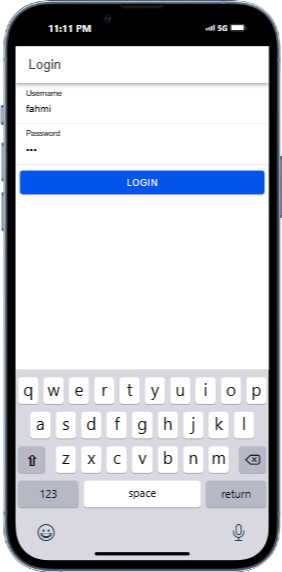
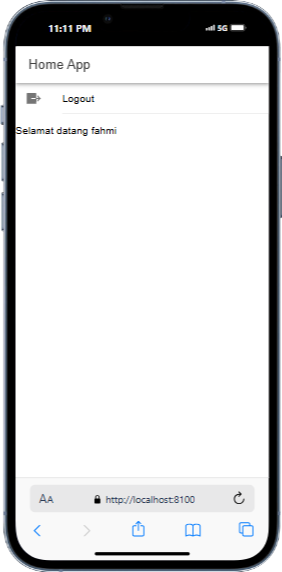

# TugasMobile7_AbdulAziz_ShiftE
 
# Aplikasi Login Ionic dengan Auth Guards

## Cara Kerja Login

Aplikasi ini menggunakan proses autentikasi dasar berbasis API yang diimplementasikan dengan **Angular**, **Ionic**, dan **PHP API** untuk memastikan pengguna hanya dapat mengakses halaman tertentu setelah login berhasil. Berikut adalah penjelasan langkah demi langkah mengenai cara kerja login dalam aplikasi ini:

1. **Database & API**  
   - Database bernama `coba-ionic` dibuat dengan tabel `user` yang menyimpan `username` dan `password` yang dienkripsi menggunakan `MD5`.
   - PHP API dibuat untuk menangani permintaan login dari aplikasi Ionic. Jika username dan password cocok dengan data di database, API mengirimkan respons yang berisi `token` login dan status `berhasil`.

2. **Pembuatan Login Service**  
   - Pada aplikasi Ionic, `services/authentication.service.ts` menangani proses login, menyimpan token, dan status autentikasi menggunakan **Capacitor Preferences**. Service ini juga mengelola status login, menyimpan token pengguna, dan menyediakan fungsi notifikasi.

3. **Login Page**  
   - Pada `login.page.ts`, pengguna memasukkan username dan password, kemudian mengklik tombol login. Aplikasi mengirimkan data login ke API menggunakan metode POST.
   - Jika respons dari API menunjukkan status `berhasil`, token dan nama pengguna disimpan dalam aplikasi, dan pengguna diarahkan ke halaman `Home`. Jika gagal, aplikasi menampilkan notifikasi kesalahan.

4. **Auth Guards**  
   - **Auth Guard** (`guards/auth.guard.ts`): Melindungi halaman `Home` agar hanya dapat diakses oleh pengguna yang telah login. Jika pengguna belum login, guard mengarahkan mereka ke halaman login.
   - **Auto Login Guard** (`guards/auto-login.guard.ts`): Mencegah pengguna yang sudah login untuk kembali ke halaman login. Pengguna diarahkan langsung ke halaman `Home` jika mereka sudah terautentikasi.

5. **Logout**  
   - Pada halaman `Home`, pengguna dapat logout melalui fungsi `logout()` di `home.page.ts`, yang menghapus token dan status autentikasi dari penyimpanan lokal dan mengarahkan pengguna kembali ke halaman login.

## Screenshots

| Login Page                                    | Home Page                                    |
|-----------------------------------------------|----------------------------------------------|
|  |  |

